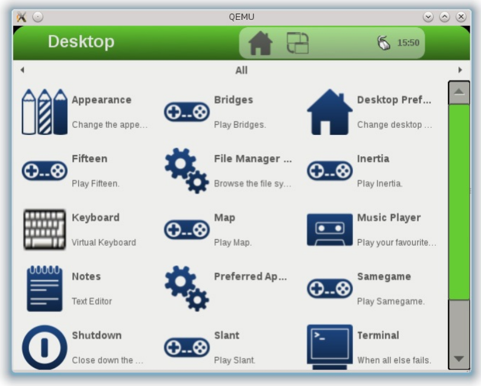

# Chapter 2 The Yocto Project

- Yocto is the prefix of the smallest fraction for units of measurements

## 2.1 Jumpstarting Your First Yocto Project Build

- We start by building our first Linux OS stack for use with the QEMU (short for Quick Emulator, a generic open source machine emulator for different CPU architectures).

### 2.1.1 Prerequisites 

- Hardware Requirements: Despite their capability to build Linux OS stacks, the Yocto Project tools require build host with an x86 architecture CPU. Both 32-bit and 64-bit CPUs are supported. A system with a 64-bit CPU is preferred for throughput reasons.
- Memory is also an important factor. The tools do not run on a system with less than 1 GB of RAM; 4 GB or more is recommended.
- Disk space is another consideration. Consumes about 50 GB of disk space.
- Internet connection: The OpenEmbedded build system that you obtain from the project’s website contains only the build system itself. Of course, the downloaded source packages are stored on your system and reused for future builds.
- Software requirements: one of those CentOS - Fedora - openSUSE - Ubuntu.

### 2.1.2 Obtaining the Yocto Project Tools

- The Yocto Project team releases a new major version of the build system every 6 months, in the April–May and October–November timeframes. All released versions of the Yocto Project tools have undergone multiple rounds of quality assurance and testing.

### 2.1.3 Setting Up the Build Host

- Setting up your build host requires the installation of additional software packages.
- BitBake requires Python with a major version of 2.6 or 2.7. BitBake currently does not support the new Python 3, which introduced changes to the language syntax and new libraries breaking backwards compatibility (for old yocto version now it used 3.8 python).
- Installing additional software packages 
    ```
    sudo apt-get install gawk wget git-core diffstat \ unzip texinf gcc-multilib build-essential chrpath socat \ libsdl1.2-dev xterm
    ``` 
- Installing Poky 
    ```
    git clone git://git.yoctoproject.org/poky
    ```

### 2.1.4 Configuring a Build Environment

- Poky provides the script oe-init-build-env to create a new build environment. The script sets up the build environment’s directory structure and initializes the core set of configuration files. It also sets a series of shell variables needed by the build system. You do not directly execute the oe-init-build-env script but use the source command to export the shell variable settings to the current shell:
    ```
    source oe-init-build-env <build>
    <build> which represent build directory 
    ``` 
- The script added the directory conf and placed the two configuration files in it: bblayers.conf and local.conf. We explain bblayers.conf in detail in Chapter 3.
    - For local.conf: Lines starting with the hash mark (#) are comments. The default value for the two parallelism options BB_NUMBER_THREADS and PARALLEL_MAKE is automatically computed on the basis of the number of CPU cores in the system using all the available cores. You can set the values to less than the cores in your system to limit the load.
        - Setting the MACHINE variable selects the target machine. Poky provides a series of standard machines for QEMU and a few. actual hardware board target machines.
        - The variable DL_DIR tells BitBake where to place the source downloads.
        - The variable TOPDIR contains the full (absolute) path to the build environment.
        - The same holds true for the SSTATE_DIR variable, which contains the path to the shared state cache.
        - The variable TMP_DIR contains the path to the directory where BitBake performs all the build work and stores the build output.

### 2.1.5 Launching the Build

- We go into detail about what build targets are and how to use them to control you build output in the following chapters. Lets build GUI image:
    ```
    bitbake core-image-sato
    ```

### 2.1.6 Verifying the Build Results
-   ```
    runqemu qemux86
    ```
    

### 2.3.5 The OpenEmbedded and Yocto Project Relationship

- The technology alignment between OpenEmbedded and the Yocto Project brought several major improvements to both projects:
    - Aligned Development: A common problem among open source projects is fragmentation: The tight alignment of OpenEmbedded and the Yocto Project ensures that users can get the benefits of both projects.
    - BitBake Metadata Layer enable logical grouping of recipes and configuration files into structures that can easily be included in and migrated to different build environments.
    - OpenEmbedded Core Metadata Layer create a common metadata layer shared between the two projects and containing all the base recipes and configuration settings.